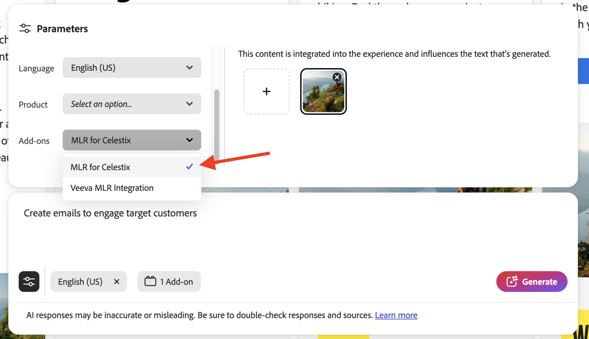

# 部署您的应用程序

运行应用程序可在部署加载项之前提供加载项行为的初步快照。 这有助于进行调试。

## 运行应用程序

在`https://localhost:9080`中运行应用程序：

```bash
aio app run
```

## 部署应用程序

1. 导航到您的部署工作区：

   ```bash
   aio app use -w [deployment_workspace]
   ```

2. 部署应用程序：

   ```bash
   aio app deploy
   ```

## 强制重新部署

您可以强制构建和部署应用程序，而无需重新提交它以供审批。

>[!NOTE]
>
>强制构建和部署会覆盖现有部署。 **首先在测试环境中彻底测试您的应用程序**。

```bash
aio app build --force-build
```

```bash
aio app deploy --force-deploy
```

## 同时生成和部署

```bash
aio app deploy --force-build --force-deploy
```

## 查找您的新应用程序

部署后，您可以在GenStudio for Performance Marketing中查看新应用程序。

### 通过URL查看

通过向GenStudio for Performance Marketing URL添加`query`参数来查看新应用程序：

```txt
https://experience.adobe.com/?ext=https://<my-deployed-add-on>.adobeio-static.net/index.html#/@<ims-org>/genstudio/create
```

### 在用户界面中查看

根据所部署的扩展类型，新扩展可在UI中的不同位置找到。 当前可用的扩展点包括：

* 合规性扩展，其中包括：
   * [*提示扩展点*](#find-prompt-extensions)，允许客户向LLM生成添加其他上下文，并且
   * [*验证扩展点*](#find-validation-extensions)，允许客户验证从LLM生成的内容。 验证通常与Prompt扩展结合使用，以确保扩展提示生成的内容符合客户要求（例如，医疗药品索赔或法律要求）
* [数字资产管理(DAM)扩展](#find-dam-extensions)
* [模板扩展](#find-template-extensions)
* [翻译扩展](#find-translation-extensions)

### 查找提示扩展

在模板的&#x200B;**参数部分**&#x200B;中的&#x200B;**插件**&#x200B;下拉列表中找到提示扩展。

{width="600" zoomable="yes"}

这将打开附加组件对话框，允许您选择要为LLM生成添加的其他上下文。

{width="600" zoomable="yes"}

### 查找验证扩展

生成提示后，可在右侧边栏中找到验证扩展，其中显示了结果。

{width="600" zoomable="yes"}

运行您选择的扩展以验证生成的内容。

{width="600" zoomable="yes"}

### 查找DAM扩展

在模板的&#x200B;**参数部分**&#x200B;中选择内容时，找到数字资产管理(DAM)扩展。 查看&#x200B;**选择位置**&#x200B;下拉列表的底部以查看任何加载项。

{width="600" zoomable="yes"}

### 查找模板扩展

选择模板时，在&#x200B;**外部模板应用程序**&#x200B;选项卡中找到模板扩展。 仅当存在可选择的模板应用程序时，此选项卡才会显示。

{width="600" zoomable="yes"}


### 查找翻译扩展

使用翻译扩展点通过代理提供您自己的翻译服务，而不是使用GenStudio默认翻译。
这些扩展没有UI位置。

如果注册了扩展，则使用提供的翻译服务。 否则，将使用默认的GenStudio翻译服务。


如果您对加载项感到满意，则可以将其分发而不使用`query`参数。

现在，您可以[分发您的应用程序](distribute-app.md)。
