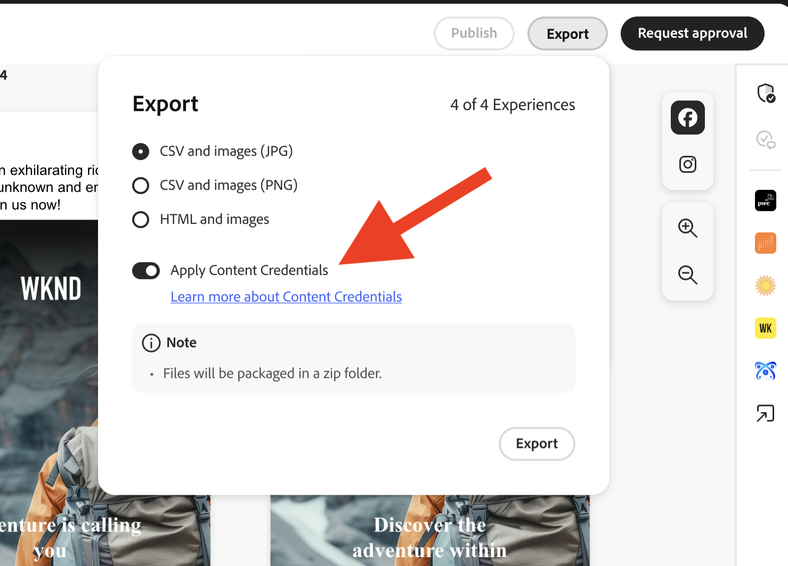

# Content Credentials组织版

了解用于证明品牌真实性并促进合规性的内容的防篡改凭据如何直接嵌入您的营销工作流程中。

>[!WARNING]
>
> 此功能当前为测试版，仅适用于已被授予访问权限的组织。 如有兴趣，请联系您的Adobe客户团队代表或[使用此链接申请注册](https://www.feedbackprogram.adobe.com/c/a/5aWPEOthrDv22Mf9CyekOy?source=qr)。

## Content Credentials入门 {#content-credentials}

>[!CONTEXTUALHELP]
>id="gspm_content_credentials"
>title="[!DNL GenStudio for Performance Marketing]中的Content Credentials"
>abstract="用于证明品牌真实性并促进合规性的内容的防篡改凭据可以直接嵌入到您的营销工作流中。"

在Admin Console中激活Content Credentials后，GenStudio for Performance Marketing用户可以在应用程序中全局启用所有资产的Content Credentials。 如果应用凭据的全局选项处于关闭状态，则用户可以选择为每个单独的资源应用Content Credentials。

发布内容后，Content Credentials将显示在外部平台上，如LinkedIn。

管理员负责在Admin Console中上传有效的X.509证书。 此步骤可确保企业的数字签名配置正确，并可在支持的Adobe DX应用程序中使用。

>[!NOTE]
>
>控制此设置可能会在将来过渡到Admin Console，从而简化跨应用程序的Content Credentials管理并增强行政监督。

## 什么是Content Credentials？ 

Content Credentials是一种持久的行业标准元数据类型，其中包含有关如何制作内容的详细信息以及有关创建者的身份信息。 当内容在线发布到支持平台时，或者使用诸如[Adobe的Inspect tool](https://contentauthenticity.adobe.com/inspect)或[Adobe Content Authenticity Chrome浏览器扩展](https://helpx.adobe.com/creative-cloud/help/cai/adobe-content-authenticity-chrome-browser-extension.html)之类的工具时，可以查看Content Credentials。  

应用Content Credentials有助于提高内容制作方式的透明度，并且可帮助您的用户将自己连接到其内容。

在Adobe上[了解有关Content Credentials的更多信息](https://helpx.adobe.com/cn/creative-cloud/help/content-credentials.html)。

## 品牌签名和资产跟踪

品牌签署内容在促进品牌完整性和用户信任方面起着重要作用。 Organizations can sign their content with a unique brand signature in Adobe applications when their certificate is properly configured in the Admin Console. This assurance of authenticity is maintained using invisible watermarking and fingerprinting technologies, which help preserve the durability of the signature throughout the content&#39;s lifecycle.

In addition to brand signing, enterprises can attach asset IDs directly to their content. This facilitates efficient tracking of assets, particularly when they are shared or posted on social media platforms. By incorporating asset IDs, organizations can trace the origin and distribution path of their content, enhancing oversight and accountability.

## Content Credentials in the marketing workflow

Applying Content Credentials can be done throughout the marketing workflow directly in GenStudio for Performance Marketing, from import and content discovery to activation and export. You&#39;ll also find credentials displayed on content for review throughout the app.

### Import and discovery

In the Content gallery, credentials are displayed on imported assets.

The Content Credential badge in the upper right corner of the thumbnail indicates &quot;Brand signed&quot; content.

Selecting signed content displays the detailed metadata: published brand, recorder, tool used, timestamp.

Content can be filtered by credential status.

### Creation and selection

Content Credential badges are shown in the Canvas asset selector.

Credential metadata is preserved as assets are selected for experiences to maintain the provenance chain throughout editing.

### Editing and transformation

During exports from a draft, modified assets are automatically re-signed and the new credential links to the original.

{width="60%"}

### Review and approval

In the Review and Approve preview, credential status is displayed for assets on the right rail.

{width="60%"}

当审阅者检查资产时，会显示每个变体的凭据详细信息。 当用户单击“保存到内容”****&#x200B;时，已批准的体验将被重新签名。

### 激活和导出

在激活期间，体验选择器中会显示凭据状态。

{width="60%"}

导出的文件将嵌入符合C2PA的凭据。

凭据完整性在所有支持的格式(JPEG、PNG、MP4)中得到了维护。

