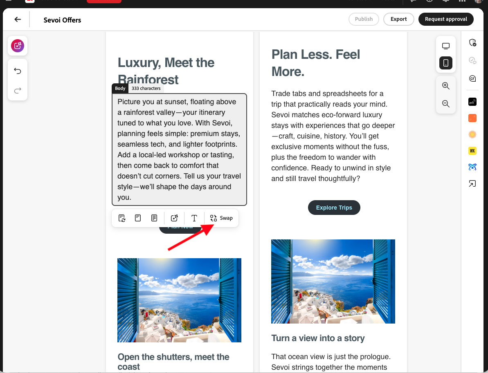

# 电子邮件体验

借助Adobe GenStudio for Performance Marketing，您可以使用创作AI来简化[创建高影响力的电子邮件体验](/help/user-guide/create/create-email-experience.md)。

[!DNL Create]使现代营销人员能够使用[指南](/help/user-guide/guidelines/overview.md)、图像资源和[精心编制的提示](/help/user-guide/effective-prompts.md)来快速[创建与品牌一致的电子邮件体验](/help/user-guide/create/create-email-experience.md)。

在生成电子邮件体验时，会在画布中创建和显示四个变体。

电子邮件体验的可编辑部分包括：

* 预标题
* 标题
* 副标题
* 正文
* call to action (CTA)
* 图像

查看[模板元素](/help/user-guide/templates/use-templates.md#template-elements)。

<!-- 
## Email capabilities

Content creators and marketers can produce brand-consistent email experiences in GenStudio for Performance Marketing. 
-->

## 多节电子邮件

电子邮件体验可以包含多个部分，允许完全自定义以符合您的品牌和目标。 [为每个部分](/help/user-guide/create/create-email-experience.md#add-parameters)选择 [!DNL Products] 和可视化资产，并使用[结构化提示](/help/user-guide/effective-prompts.md#structured-prompts)制作独特的内容。 每个部分都支持一个可视资产。

请参阅[自定义包含节](/help/user-guide/templates/customize-template.md#sections-or-groups)的模板，了解如何创建多节模板。

## 渐进式加载

内容生成过程开始时，电子邮件变体中已生成内容的每个部分都会逐步加载到画布中。 体验、资源以及体验中的字段和部分在生成时分别显示在画布中。

单击&#x200B;**[!UICONTROL 生成]**&#x200B;后，画布底部会显示一个加载指示器，用于更新生成进度。

电子邮件体验的每个字段和部分都按照以下顺序逐步加载：

1. 变体名称
1. 所有变体的主题行
1. 预标题
1. 标题、电子邮件正文（用于单节电子邮件）和行动号召
1. 后续部分的电子邮件正文（用于多部分电子邮件）
1. 品牌验证

   进行品牌验证和内容检查过程，并为每个变体填充&#x200B;[_内容检查_&#x200B;摘要](/help/user-guide/guidelines/brand-validation.md#content-check-summary)。

## 字符数

生成一组电子邮件变体后，您可以看到为每个部分显示的字符数。 将鼠标悬停在生成的部分（如主题行或正文）上或单击该部分，可查看该部分的名称和字符计数。

{width="500" zoomable="yes"}

## 内容片段交换 {#content-fragment-swap}

>[!NOTE]
>
>内容片段交换现在可用于画布上的&#x200B;**电子邮件**&#x200B;体验。 即将支持&#x200B;**Horizon**&#x200B;渠道。

企业电子邮件内容通常既需要新生成的副本，又需要经过批准的模块块（例如免责声明、安全语言、优惠和管控声明），以及您为模板定制的内容。 在[!DNL Adobe Experience Manager]中存储模块化内容的团队可以在不离开[!DNL GenStudio for Performance Marketing]的情况下查找和交换要在电子邮件体验中使用的内容。 此项可用于执行以下操作：

* **合规性感知内容：** AI可以填充创意版版块，而合规性批准的片段可以替换可插入版块；通过导出，锁定的法律版块保持不变。
* **可重复使用的已批准内容组件：**&#x200B;已批准的标题、区域免责声明或产品描述可以保留在[!DNL Adobe Experience Manager]中的记录系统，而作者将它们拉入变体而不采用复制 — 粘贴解决方法。

创建者在画布上汇集体验；品牌和合规性团队将审批工作流保留在[!DNL Adobe Experience Manager]中；IT和集成团队连接存储库和您的组织所需的权限。

{width="500" zoomable="yes"}

当您的组织启用内容片段交换时，您可以预期：

* 可以从连接的内容库填充内容片段字段，而不是仅手动键入或人工智能生成。
* 使用元数据（如促销活动、角色、渠道、语言和品牌）浏览、搜索和筛选片段。
* 配置多个存储库时，存储库选择器可用。
* 在替换字段文本之前预览片段。
* 在一个操作中跨所有变体传播片段选择。

{width="500" zoomable="yes"}

您的组织选择可用的内容片段源和存储库。 请参阅[查找内容片段扩展](/help/extensibility/deploy-app.md#find-content-fragment-extension)，了解管理员如何配置源，以及作者如何通过&#x200B;**[!UICONTROL 交换]**&#x200B;从画布交换副本。

您还可以在HTML画布上将批准的电子邮件体验翻译成多种语言。 请参阅[翻译和本地化体验](/help/user-guide/create/translate-experiences.md)。
