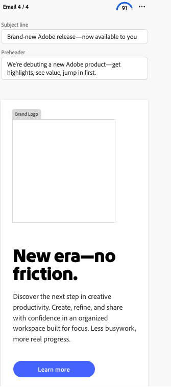
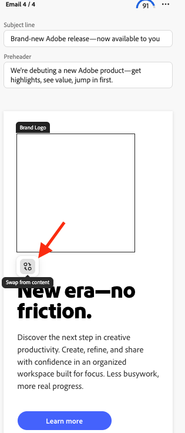

# 在[!DNL Create]中使用徽标交换

在[!DNL GenStudio for Performance Marketing]中的内容创建期间，使用徽标交换替换模板中的品牌徽标。

## 先决条件

- 使用[徽标交换设置指南](logo-swap-setup.md)设置模板。 只有包含所需徽标占位符的模板才会显示徽标交换图标。
- 要在&#x200B;**[!DNL Create]**&#x200B;工作流期间具有可互换的徽标，必须在&#x200B;**[!DNL Brands]**&#x200B;中存储有徽标。

## 在内容创建期间交换徽标

1. 在&#x200B;**[!DNL Create]**&#x200B;中，在登陆页面上选择一个渠道。
1. 选择包含可交换徽标的模板。 模板预览显示一个灰色占位符框，其中显示徽标。
   {width="300"}
1. 照常创建内容。 将显示四个变体。
1. 将鼠标悬停在徽标区域上以显示占位符。
   {width="200"}
1. 单击“品牌徽标”区域，然后单击“从内容交换”****。
   从内容{width="200"}
1. 在“品牌徽标”面板中，选择一个徽标，然后单击&#x200B;**[!UICONTROL 使用]**&#x200B;以将其应用于当前变体，或单击&#x200B;**[!UICONTROL 应用于所有变体]**&#x200B;以将其应用于所有四个变体。
1. 您还可以按品牌名称或过滤器使用搜索徽标来查找徽标。
   {width="300"}
1. 或者使用过滤器搜索来查找徽标。
   {width="300"}
1. 成功交换徽标后，继续内容创建工作流（关闭草稿、导出或请求审批）。

徽标可随时再次交换。

>[!NOTE]
>如果未显示“徽标交换”图标，请确认模板已配置为使用“徽标交换”，并且徽标在[!DNL Brands]中可用。
