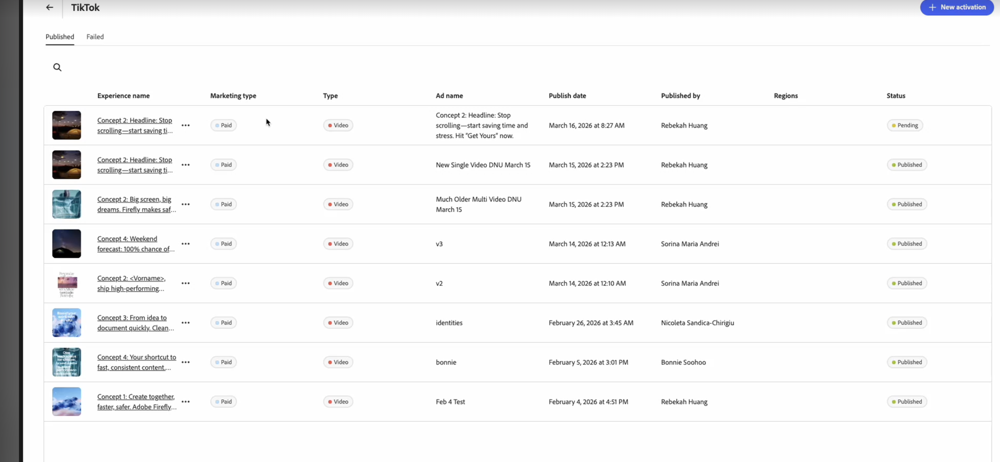

# TikTok体验

使用[!DNL GenStudio for Performance Marketing]，您可以在[[!DNL Create]](/help/user-guide/create/overview.md)工作流中创建TikTok广告作为付费媒体体验。 生成创意变体，运行品牌和渠道检查，发布到[!DNL Content]，并通过[[!DNL Activate]](/help/user-guide/activation/overview.md)激活，以将内容交付到TikTok广告管理器进行最终审查和启动。

[!DNL GenStudio for Performance Marketing]中的TikTok适合更广泛的全渠道工作流程：您可以与其他社交和显示渠道（例如Meta和LinkedIn）一起分析[[!DNL Insights]](/help/user-guide/insights/overview.md)中的TikTok促销活动和广告效果，而不是切换到单独的报表工具。

[!DNL Insights]表面量度，包括：

* 展示次数
* 点击次数
* 点进率(CTR)
* 每次点击成本(CPC)
* 每次收购成本(CPA)
* 每毫升成本(CPM)
* 支出

在一个地方查看结果、比较创意效果并优化定位和预算。 每日数据更新可帮助您在不离开[!DNL GenStudio for Performance Marketing]的情况下更快地优化。

## 先决条件

在创建或激活TikTok广告之前，请完成以下操作：

### 访问和角色

确保您在GenStudio for Performance Marketing中具有&#x200B;**编辑者**&#x200B;角色或更高版本。 查看[用户角色和权限](/help/user-guide/user-roles.md)。

### 连接您的TikTok Ads帐户

1. 转到&#x200B;**[!UICONTROL 设置]** > **[!UICONTROL TikTok]** > **[!UICONTROL 管理]** > **[!UICONTROL 添加帐户]**。
1. 在弹出窗口中，登录到TikTok广告管理器。
1. 确保您对广告帐户具有&#x200B;**操作员**&#x200B;或&#x200B;**管理员**&#x200B;访问权限。
1. 将TikTok添加为渠道，并完成TikTok广告管理器的OAuth登录。

### 激活配置

系统管理器已在[!DNL Activate]中连接您的TikTok Ads帐户：

* 至少启用了一个TikTok广告帐户以供使用。

### 创建配置

* 您的[品牌、产品和角色](/help/user-guide/guidelines/overview.md)已配置，因此应用程序可以生成品牌内副本和布局。
* 至少会上传一个TikTok模板。 Adobe建议使用TikTok垂直视频模板，该模板针对进纸位置进行了优化，具有&#x200B;**9:16**&#x200B;宽高比以及用于顶部和底部UI的安全区域。
* 视频已上传到[!DNL Content]。

## 生成TikTok信息源内广告

### 启动TikTok体验

创建工作流中的{width="90%"}
**开始TikTok体验**：

1. 转到&#x200B;**[!UICONTROL 创建]**&#x200B;并选择&#x200B;**[!UICONTROL TikTok]**。
1. 选择TikTok模板并单击&#x200B;**[!UICONTROL 使用]**。
1. 在画布中，选择&#x200B;**[!UICONTROL 品牌]**、**[!UICONTROL 产品]**、**[!UICONTROL 角色]**&#x200B;和&#x200B;**[!UICONTROL 语言]**。
1. 从[!DNL Content]中选择视频。
1. 输入TikTok标题副本的提示。
1. 单击&#x200B;**[!UICONTROL 生成]**。
   {width="40%"}

GenStudio for Performance Marketing提供了四种创意变体。

您可以：

* 使用&#x200B;**[!UICONTROL 重新生成]**&#x200B;或&#x200B;**[!UICONTROL 优化]**&#x200B;调整色调、长度或强调。
* 直接在画布中编辑文本。
* 使用&#x200B;**[!UICONTROL 交换]**&#x200B;从[!DNL Content]中选择替代视频。
* 使用&#x200B;**[!UICONTROL 裁切]**&#x200B;或&#x200B;**[!UICONTROL 重新帧]**&#x200B;调整&#x200B;**9:16**&#x200B;帧内的视频布局。

### 运行品牌和渠道检查

在保存或发送体验以供审阅之前，请运行内容检查：

1. 单击&#x200B;**[!UICONTROL 内容检查]**（品牌和渠道检查）。
1. 查看验证结果：
   * **品牌指南** — 色调、限制用语、徽标使用。
   * **TikTok渠道规则** — 长宽比、文件类型、复制长度。
1. 解决任何标记的问题（例如，复制长度或密集的屏幕文本）。

有关内容检查的详细信息，请参阅[品牌验证](/help/user-guide/guidelines/brand-validation.md)。

## 在GenStudio for Performance Marketing中保存TikTok广告

将您的TikTok体验移入[!DNL Content]库，以便审核、重用和激活该库。
有两种状态：

* **草稿体验** — 正在处理且未批准的工作。
* **已发布的体验** — [!DNL Content]中已批准并可供激活的内容。

### 发送以供审查

**发送审阅**：

1. 在&#x200B;**[!DNL Experience]**&#x200B;标题中，单击&#x200B;**[!UICONTROL 请求审阅]**。
1. 选择批准者（例如，品牌、法律或绩效）。
   * （可选）在&#x200B;**[!UICONTROL 设置]**&#x200B;中添加注释。
1. 单击&#x200B;**[!UICONTROL 发送审阅]**。

审批者可以查看视频预览、描述，以及call to action (CTA)和品牌与渠道检查结果。 他们可以批准体验或请求更改。

### 发布到[!DNL Content]

在所有必需的审批之后：

1. 单击&#x200B;**[!UICONTROL 发布到内容]**。
1. 确认元数据：
   * 促销活动或激活名称
   * 地区、语言、角色、funnel舞台
   * 渠道：TikTok
1. 单击&#x200B;**[!UICONTROL 发布]**。

TikTok广告现在显示在[!DNL Content]中。 可以使用诸如[!DNL Channel]或[!DNL Campaign]之类的筛选器发现它，并且可以在[!DNL Activate]中选择它。

## 激活TikTok广告

TikTok激活使用与Meta和Campaign Manager 360 (CM360)相同的[!DNL Activate]模块。 您可以从[!DNL Content]工作流或[!DNL Activate]工作流开始。

**要开始TikTok激活**：

1. 打开“TikTok渠道”拼贴。
1. 单击&#x200B;**[!UICONTROL 创建激活]**。
1. 从[!DNL Content]中选择一个或多个已发布的TikTok体验。

每个体验通常映射到一个TikTok广告，并具有一个或多个视频变体。

### 配置体验设置

对于每个选定的体验，请确认：

* 主文本
* call to action
* 目标URL

### 配置平台设置

提供TikTok广告管理器详细信息，例如：

* TikTok Ads帐户
* 营销活动
* 广告组
* 广告名称（每个TikTok广告一个）

### 审阅并发布

1. 查看所有创意和平台详细信息。
1. 单击&#x200B;**[!UICONTROL 发布]**。

GenStudio for Performance Marketing在暂停或草稿状态下将广告推送到TikTok广告管理器。

### 接下来会发生什么

_正在发布_&#x200B;模式随即出现并自动关闭。 系统已将您重定向至“TikTok激活”表。

{width="30%"}

激活表显示最新的激活，处理完成时状态为&#x200B;**Pending**。您可以在发布完成时导航离开。

{width="90%"}

完成后，确认弹出窗口会显示成功或失败消息。 如果单击该弹出窗口，或单击激活表中的TikTok激活，则打开&#x200B;**详细信息**&#x200B;页面。 **详细信息**&#x200B;页面包含完整激活信息以及指向TikTok广告管理器中已发布广告的深层链接。

如果激活失败，则显示&#x200B;**失败**&#x200B;状态并显示TikTok的错误消息。

在TikTok Ads Manager中，媒体团队可以：

* 执行最终检查。
* 实时启用广告或广告组。

与其他渠道一样，GenStudio for Performance Marketing以非活动状态提供创意，以便渠道所有者控制最终启动时间和预算。
