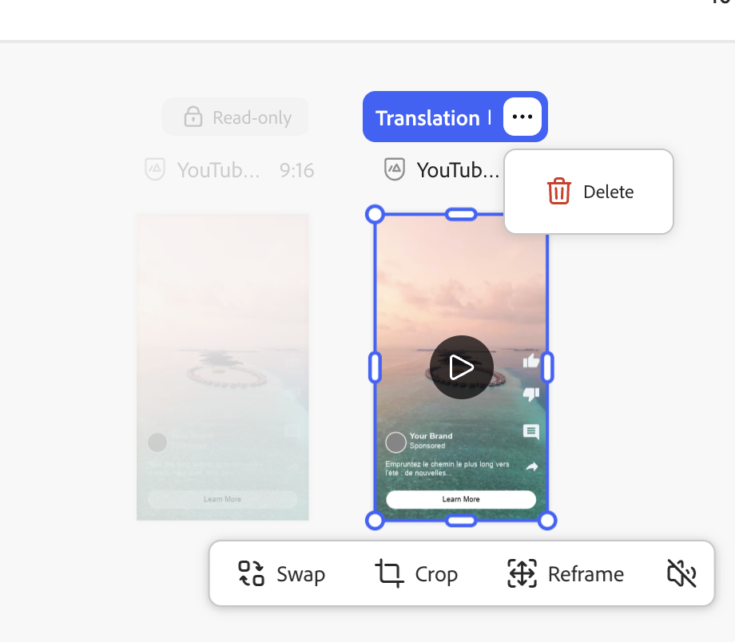

# 翻译和本地化体验

Adobe [!DNL GenStudio for Performance Marketing]在HTML画布上提供开箱即用的翻译，这样全球和区域营销人员就可以将已批准的体验扩展到多种语言，而无需外部翻译工具。

该功能默认使用Azure Open AI。 您的组织还可以通过[翻译扩展](/help/extensibility/deploy-app.md#find-translation-extensions)连接首选翻译服务。

翻译从保存在[!DNL Content]中的已批准体验开始。 源体验可以是任何语言。 每个翻译的变体都会在[!DNL Create]画布上作为可编辑的草稿打开，您可以导出、发送以供审核并发布为单独的体验。

## 支持的体验

HTML画布上的现成翻译支持：

* [电子邮件体验](/help/user-guide/create/email-experiences.md)
* 付费媒体体验，包括[Meta](/help/user-guide/create/meta-experiences.md)、[LinkedIn](/help/user-guide/create/linkedin-experiences.md)和[显示](/help/user-guide/create/display-ad-experiences.md)广告

## 开始之前

确认您要翻译的体验已获得&#x200B;**批准**，并且可在[!DNL Content] _[!UICONTROL 体验]_&#x200B;库中找到。 草稿或审核中的体验不是合格的翻译源。

如果您的组织注册了自定义翻译扩展，GenStudio for Performance Marketing将使用该服务，而不是默认的Azure Open AI翻译。 请参阅[查找翻译扩展](/help/extensibility/deploy-app.md#find-translation-extensions)。

## 从[!DNL Create]翻译 {#translate-from-create}

从[!DNL Create]登陆页面开始翻译以将批准的体验本地化。

{width="600" zoomable="yes"}

**从[!DNL Create]**&#x200B;翻译：

1. 在[!DNL Create]中，滚动到&#x200B;_内容创建_&#x200B;部分。
1. 单击&#x200B;**[!UICONTROL 翻译并本地化副本]**。
1. 选择要翻译的已批准电子邮件或付费媒体体验。 单击&#x200B;**[!UICONTROL 使用]**&#x200B;按钮。
1. 从支持的语言列表中选择目标语言。 单击&#x200B;**[!UICONTROL 翻译]**。

已翻译的变量将显示在画布上。

## 从[!DNL Content]翻译 {#translate-from-content}

当您浏览已批准的体验时，您还可以从[!DNL Content]开始翻译。

### 从体验库

{width="500" zoomable="yes"}

**要从体验库**&#x200B;进行翻译：

1. 在[!DNL Content]中，打开&#x200B;**[!UICONTROL 体验]**&#x200B;选项卡。
1. 找到要翻译的已批准体验。
1. 单击体验卡上的选项（三个圆点）菜单。
1. 单击&#x200B;**[!UICONTROL 翻译]**。
1. 从支持的语言列表中选择目标语言。 单击&#x200B;**[!UICONTROL 翻译]**。

## 在画布上使用翻译

在HTML画布上，无法编辑源体验，因为它已被批准。 电子邮件源体验显示为已锁定。 可直接在画布上编辑已翻译变体中的文本。 有关编辑变体副本的指导，请参阅[管理变体](/help/user-guide/create/manage-variants.md)。

翻译的体验不会运行品牌验证或显示品牌分数。 源体验已通过品牌指南创建、审查和批准。

翻译的体验不支持片段重新生成。

### 删除已翻译语言

**要从画布中删除已翻译语言**：

1. 在[!DNL Create]画布上，单击已翻译变体标题上的选项（三个点）菜单。
1. 单击&#x200B;**[!UICONTROL 删除]**。

{width="500" zoomable="yes"}

将从画布中删除已翻译语言。

### 刷新付费媒体翻译

编辑已翻译的付费媒体副本后，您可以重新加载原始翻译输出。

**刷新付费媒体翻译**：

1. 在[!DNL Create]画布上，打开已编辑翻译变体上的选项菜单。
1. 单击&#x200B;**[!UICONTROL 刷新翻译]**。

>[!NOTE]
>
>刷新翻译适用于付费媒体体验。 电子邮件翻译目前不支持刷新翻译。

## 导出、审阅和发布

在画布上加载翻译后，您可以导出翻译，发送它们以供审批，并将批准的变体发布到[!DNL Content]。

**要导出翻译的体验**：

1. 在[!DNL Create]画布上，单击工具栏中的&#x200B;**[!UICONTROL 导出]**。
1. 选择导出格式。
   * 电子邮件：**CSV和图像**&#x200B;或仅&#x200B;**HTML**
   * 付费媒体： **CSV + JPG**、**CSV + PNG**&#x200B;或&#x200B;**HTML +图像**
1. 单击&#x200B;**[!UICONTROL 导出]**。

您也可以[从 [!DNL Content]](/help/user-guide/content/manage-assets.md#export-experiences)导出体验。

**请求审阅和批准**：

1. 在[!DNL Create]画布上，单击&#x200B;**[!UICONTROL 请求审批]**。
1. 至少分配一个审批者并发送请求。

有关审阅工作流的详细信息，请参阅[请求审阅和批准](/help/user-guide/approvals/request-review.md)。

**要发布已批准的翻译**：

1. 在审批者批准转换的变体后，单击&#x200B;**[!UICONTROL 发布]**。
1. 在发布窗口中，确认元数据，例如营销活动名称、时间范围、区域和关键字。

请参阅[发布批准的内容](/help/user-guide/approvals/publish-content.md)。

每个已发布的翻译都将作为单独的体验保存到[!DNL Content]。

## 翻译的体验元数据

已发布的翻译包含将每个变体链接回其源的元数据，包括：

* **标题** — 遵循模式`Translation from "<source title>" <channel>`，如`Translation from "Summer campaign" Meta`
* **创建者** — 启动翻译的用户
* **创建日期** — 翻译日期
* **已翻译源** — 指向[!DNL Content]中的源体验的链接
* **翻译自** — 源语言

## 限制

在HTML画布上翻译体验时，请牢记以下限制：

* 源体验必须已在[!DNL Content]中批准和保存。
* 品牌验证不会在翻译的变量上运行。
* 翻译的体验不支持片段重新生成。
* 刷新翻译仅适用于付费媒体。

## 相关信息

* [电子邮件体验](/help/user-guide/create/email-experiences.md)
* [Meta体验](/help/user-guide/create/meta-experiences.md)
* [显示广告体验](/help/user-guide/create/display-ad-experiences.md)
* [管理资源和体验](/help/user-guide/content/manage-assets.md)
* [查找翻译扩展](/help/extensibility/deploy-app.md#find-translation-extensions)
