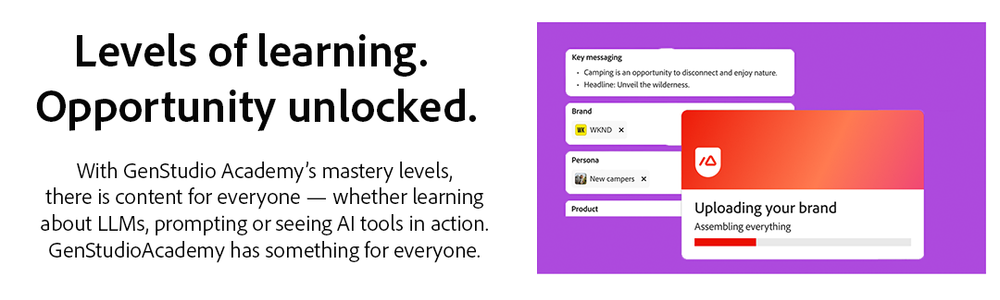

# GenStudio Academy

<table>

 <tr style= "border: 0;">

  <td> <strong style= "font-size: 2em">提升您的创作AI知识。 </strong>
掌握创作AI技能，以转变您的创意和营销工作流程。 
<a href="https://learningmanager.adobe.com/accountiplogin?ipId=16970&amp;accesskey=c4988oojirhb5" rel="noreferrer" target="_blank" class="spectrum-Button spectrum-Button--fill spectrum-Button--accent spectrum-Button--sizeM">注册</a>          <a href="https://genstudioacademy.adobelearningmanager.com/" rel="noreferrer" target="_blank" class="spectrum-Button spectrum-Button--fill spectrum-Button--accent spectrum-Button--sizeM">登录</a></td>

  <td></td>

 </tr>

</table>

<table>

 <tr style= "border: 0;">

  <td align="center">

    <strong style= "font-size: 2em">GenStudio Academy主创作AI。</strong>
磨练基本技能，随时随地完全免费地将创意AI集成到您的创意和营销工作流中。

  </td>

 </tr>

</table>

>[!BEGINSHADEBOX]

<table>

 <tr style= "border: 0;">

  <td></td>

  <td align="center"> <strong style= "font-size: 2em">用于营销的创作AI。 已简化。</strong>
 GenStudio Academy将复杂的创作AI任务转换为易于遵循的课程，例如转换品牌指南。 通过可下载的指南和视频，学习者可以掌握创新型人工智能，一次一个概念。
<a href="https://learningmanager.adobe.com/accountiplogin?ipId=16970&amp;accesskey=c4988oojirhb5" rel="noreferrer" target="_blank" class="spectrum-Button spectrum-Button--fill spectrum-Button--accent spectrum-Button--sizeM">立即浏览</a></td>

 </tr>

</table>

>[!ENDSHADEBOX]

<table>

 <tr style= "border: 0;">

  <td align="center"> <strong style= "font-size: 2em">学习级别。 无限机会已解锁。</strong>
利用GenStudio Academy的精通水平，可以轻松找到可提升您创造性人工智能技能的内容 — 无论您是学习学习学习学习型人工智能、掌握提示创建还是查看正在运行的人工智能工具。 GenStudio Academy为每个人准备了一些东西。</td>

  <td></td>

 </tr>

</table>

<table>

    <tr style="border: 0;">

        <td colspan="3">

            <strong style="font-size: 2em;">即将推出</strong>

        </td>

    </tr>

    <tr style="border: 0;">

        <td align="center">

            

            

                <strong>提示和技巧</strong>

            

            
以最有效的方式使用GenStudio for Performance Marketing的提示和技巧。

        </td>

        <td align="center">

            

            

                <strong>社交学习</strong>

            

            
轻松地向同事学习，并在整个组织内分享知识。

        </td>

        <td align="center">

            

            

                <strong>专家课程</strong>

            

            
解锁营销专家级人工智能技能的高级课程。

        </td>

    </tr>

</table>

>[!BEGINSHADEBOX]

<table>

    <tr></tr>

    <tr style="border: 0;">

        <td>

            

        </td>

        <td>

            <strong style="font-size: 3em">实践您的学习。</strong>

            
探索GenStudio for Performance Marketing，这是一个创新型人工智能优先应用程序，可让营销团队创建自己的广告和电子邮件，以推动有影响力的个性化营销活动。

            

                <a href="https://business.adobe.com/products/genstudio-for-performance-marketing.html" rel="noreferrer" target="_blank" class="spectrum-Button spectrum-Button--fill spectrum-Button--accent spectrum-Button--sizeM">

                    前往该处

                </a>

            

        </td>

    </tr>

    <tr></tr>

</table>

>[!ENDSHADEBOX]
