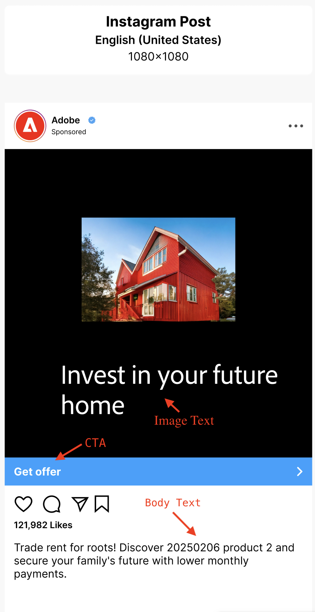
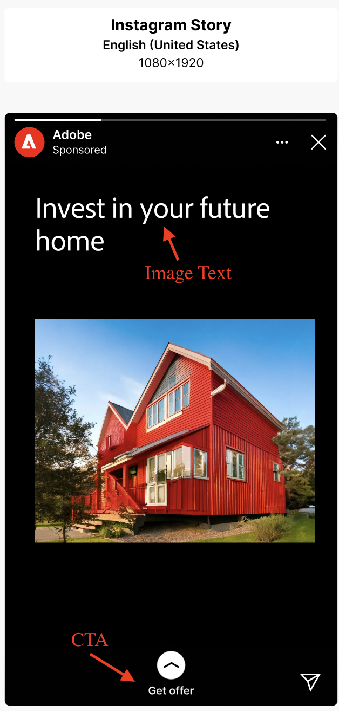
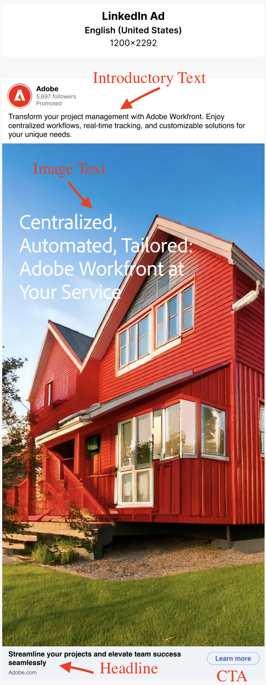
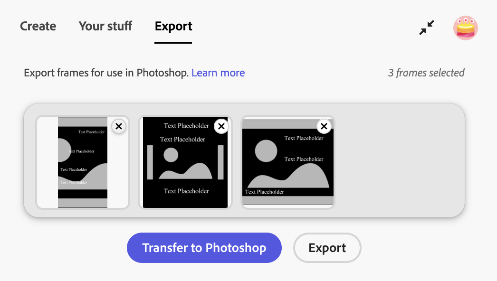

# 适用于GenStudio for Performance Marketing的Figma插件

GenStudio for Performance Marketing Figma插件会在Figma应用程序中添加一个新面板，以便您生成品牌内内容。
[从Figma社区商城查找并安装插件](https://www.figma.com/community/plugin/1604251370122180013/firefly-enterprise-and-genstudio)。

本页介绍如何配置和使用插件。

此插件的功能包括：

* 将Figma文本元素映射到GenStudio for Performance Marketing字段，如`headline`、`body`、`on_image_text`等。
* 根据品牌、角色、产品和文本提示生成新的Meta、LinkedIn或显示广告[!DNL Experiences]。
* 通过将映射的Figma元素中的文本替换为GenStudio for Performance Marketing生成的值，直接在Figma文档中创建[!DNL Experiences]。
* 根据提示重新短语、缩短、延长或翻译现有内容。
* 将生成的[!DNL Experiences]翻译成多种语言。
* 将生成的[!DNL Experiences]作为平面化图像导出到本地源。
* 将生成的[!DNL Experiences]导出到GenStudio for Performance Marketing。
* 使用可适应Figma画布中所选元素的插件选项。

>[!VIDEO](https://video.tv.adobe.com/v/3478809?learn=on)

## 创建模板

该插件要求Figma文档的前两个级别遵循以下约定：

* **节** — 这表示父项目，它可以包含多个模板。
* **框架** — 表示项目中的模板。 模板中可以填充文本、图像、组件和其他元素。

### Meta模板

支持以下模板大小：

对于Instagram或Facebook帖子：

* 宽度：1080像素（固定）
* 高度：1080像素或1350像素

对于Instagram或Facebook故事：

* 宽度：1080像素（固定）
* 高度：1920像素

插件会根据模板的高度确定所生成体验的颜色。

### 显示模板

没有固定大小要求。 显示模板支持任何大小。

### LinkedIn模板

* 宽度：1200像素（固定）
* 高度：1200像素、628像素、2292像素、1800像素或1500像素

### 字段角色映射

该插件需要了解模板的不同元素，例如标题、正文或图像。

**Meta字段角色包括**：

* 图像
* 图像文本
* CTA
* 正文文本
* 标题
* 网站URL
* 显示链接
* 手动字段

请参阅下面如何映射其中一些字段角色。

| {width="50%" align="center"}  | {width="60%" align="center"}  |
|:---:|:---:|
| {width="50%" align="center"}  | {width="60%" align="center"}  |

**LinkedIn字段角色包括**：

* 图像
* 介绍性文本
* 图像文本
* 标题
* CTA
* 网站URL
* 手动字段

请参阅下面如何映射其中一些字段角色。

{width="20%" align="center"}

插件会记住这些映射，以便用于生成的内容。 字段角色可以映射到多个模板元素。 手动字段适用于您希望保留文本可读性但不标记为生成的元素。

>[!IMPORTANT]
>
> **您必须通过将`image`字段角色分配给模板中的至少一个图像元素来映射图像**。

要分配元素角色，请执行以下操作：

1. 在模板中选择元素（文本、图像等）。
1. 使用下拉菜单分配角色。

{width="60%"}

{{$include /help/_includes/field-mapping-exceptions.md}}

## 生成新内容

使用GenStudio for Performance Marketing AI生成或制作图形模板中元素的变体。

1. 如果您使用GenStudio插件游乐场或已经准备好的模板，请选择包含广告模板的部分节点。 您可以在&#x200B;**图层**面板中或通过直接单击画布中的部分来执行此操作。
   {width="50%" zoomable="yes"}
1. 在插件窗口中，输入变体的项目名称，选择内容的平台，并填写其他必需信息。 然后单击&#x200B;**[!UICONTROL 完成设置]**按钮。
   {width="30%" zoomable="yes"}
1. 选择要用于内容生成的[!DNL Brand]、[!DNL Persona]和[!DNL Product]。
1. 选择要生成的变体数（最多八个）。
1. 使用&#x200B;**[!UICONTROL 选择内容]**&#x200B;下的按钮浏览和选择资源中的图像。 40个最近添加的资产显示在最前，您可以搜索其他资产。 所选图像会自动调整大小以适合您的模板。
1. 输入文本提示。 **[!UICONTROL 字段]**&#x200B;列表中的每个字段都将&#x200B;**[!UICONTROL 操作]**&#x200B;选项设置为&#x200B;**[!UICONTROL 为新内容生成]**。
1. 映射所有字段角色。 查看[字段角色映射](#field-role-mapping)。
1. 单击&#x200B;**[!UICONTROL 生成]**&#x200B;按钮。

## 从现有内容翻译或生成广告复制变体

使用GenStudio for Performance Marketing人工智能生成广告复制变体或翻译图形模板。

1. 选择包含广告模板的部分节点。 您可以在&#x200B;**图层**面板中或通过直接单击画布中的部分来执行此操作。
   {width="50%" zoomable="yes"}
1. 在插件窗口中，输入变体的项目名称，然后选择内容的平台。
1. 在&#x200B;**[!UICONTROL 目标是什么？]**&#x200B;中，选择&#x200B;**[!UICONTROL 生成变体]**&#x200B;或&#x200B;**[!UICONTROL 转换]**，然后单击&#x200B;**[!UICONTROL 完成设置]**按钮。
   {width="30%" zoomable="yes"}
1. 选择要用于内容生成的[!DNL Brand]、[!DNL Persona]和[!DNL Product]。
1. 选择要生成的变体数量。
1. 使用&#x200B;**[!UICONTROL 选择内容]**&#x200B;下的按钮浏览和选择资源中的图像。 40个最近添加的资产显示在最前，您可以搜索其他资产。 所选图像会自动调整大小以适合您的模板。
1. 输入文本提示。 **[!UICONTROL 字段]**&#x200B;列表中的每个字段都将&#x200B;**[!UICONTROL 操作]**&#x200B;选项设置为&#x200B;**[!UICONTROL 为新内容生成]**。
1. 映射所有字段角色。 查看[字段角色映射](#field-role-mapping)。
1. 在插件左侧的面板中选择每个字段类型以生成变体或翻译，并将初始内容粘贴到每个&#x200B;**[!UICONTROL 初始内容]**框中。
   {width="60%" zoomable="yes"}
1. 单击&#x200B;**[!UICONTROL 生成]**&#x200B;按钮。

## 生成后翻译内容

1. 选择要翻译的层代。
   {width="20%" zoomable="yes"}
1. 选择&#x200B;**[!UICONTROL 翻译]**，然后单击&#x200B;**[!UICONTROL 翻译]**。
1. 选择目标语言。
1. 单击&#x200B;**[!UICONTROL 选择]**。

翻译结果包括：

* 此时将显示一个新页面，其中包含已翻译的内容。
* 每个翻译都会显示目标语言或区域设置。
* 原始内容在原始页面中保持不变。

{width="60%" zoomable="yes"}

## 生成后对内容字段执行的其他操作

编辑字段中的现有内容时，插件面板中会显示有用的选项。

{width="30%" zoomable="yes"}

选项包括：

* 更改&#x200B;**[!UICONTROL 值]**&#x200B;以直接更改文本。 更改此内容会自动应用于所有选定的变体。
* AI可以执行许多&#x200B;**[!UICONTROL 操作]**&#x200B;选项，包括：

| 操作 | 描述 |
| --- | --- |
| **[!UICONTROL 生成]** | 生成文本的新变体。 |
| **[!UICONTROL 重新短语]** | 生成文本的新变体。 |
| **[!UICONTROL 缩短]** | 生成较短的文本变体。 |
| **[!UICONTROL 长度]** | 生成较长的文本变体。 |

选择&#x200B;**[!UICONTROL 操作]**&#x200B;选项后，使用&#x200B;**[!UICONTROL 重新生成]**&#x200B;按钮重新生成内容。

## 导出体验

变体可以作为GenStudio for Performance Marketing [!DNL Experiences]从Figma导出。

1. 通过执行以下操作之一，选择要在Figma画布中导出的内容：
   * 在画布中选择生成部分，然后在插件面板中单击&#x200B;**[!UICONTROL 全部标记为导出]**。
     {width="20%" zoomable="yes"}
   * 在画布中选择单个层代，然后在插件面板中单击&#x200B;**[!UICONTROL 标记为导出]**。
     {width="20%" zoomable="yes"}
1. 从侧栏菜单中选择“导出”项目。
   为Meta广告显示{width="60%" zoomable="yes"}
1. 选择目标。
1. 单击&#x200B;**[!UICONTROL 导出]**&#x200B;以导出内容。

在插件面板中创建ZIP文件，或显示指向&#x200B;**[!UICONTROL 在GenStudio中打开]**&#x200B;的链接。 使用ZIP链接选择保存文件的位置，或选择&#x200B;**[!UICONTROL 在GenStudio中打开]**。

## 将Figma帧转换为Photoshop

>[!NOTE]
>
> 要执行此任务，您需要Figma插件和[GenStudio Photoshop](photoshop-plugin.md)。

可以使用Figma插件将一个Figma框架、多个框架或整个文档转换为Photoshop格式，并将其导出以用于[GenStudio Photoshop](photoshop-plugin.md)。 目前，在转换过程中仅支持可视性、字体大小和基本图层属性等主要属性。 目前尚不支持删除线、上标、下标、不透明度百分比、渐变和类似高级属性等功能。

该插件支持以下用于转换的Figma层类型：

* **帧**
* **组**
* **实例**
* **文本**
* **矢量**
* **图像**

转换为PSD时，支持的图层将映射到Photoshop，如下所示：

| 图形图层类型 | 转换为Photoshop | 注释 |
| --- | --- | --- |
| **帧** | 图层组 | <ul><li>图形帧将转换为Photoshop图层组。</li><li>嵌套框架变为嵌套组。</li><li>框架尺寸将成为PSD画板或组边界（取决于选择）。</li></ul> |
| **组** | 图层组 | <ul><li>图形组直接转换为Photoshop图层组。</li><li>图层层次结构和栈叠顺序保持不变。</li></ul> |
| **实例** | 图层组 | <ul><li>组件和实例将被拼合到标准的Photoshop层组中。 未保留组件元数据和变量逻辑。</li><li>所有子层都保留在组内。</li></ul> |
| **文本** | 文本图层 | <ul><li>图形文本图层转换为可编辑的Photoshop文本图层。</li><li>文本层次结构和位置将保留。</li></ul> |
| **矢量** | 形状图层 | <ul><li>图形矢量图层将转换为Photoshop形状图层。</li><li>如果可能，将保留路径。</li><li>如果应用了不受支持的效果，则可能会栅格化复杂矢量。</li></ul> |
| **图像** | 栅格图层 | <ul><li>图形图像图层将转换为Photoshop光栅图层。</li><li>图像缩放和定位将被保留。</li></ul> |

### 如何转换帧

要转换帧：

1. 在Figma中打开Firefly Enterprise和GenStudio插件，然后单击插件UI中的&#x200B;**[!UICONTROL 导出]**&#x200B;选项卡。
1. 在画布上，选择要导出的一个或多个帧。 您可以选择单个帧或多个帧。
1. 执行下列操作之一：

   * 单击&#x200B;**[!UICONTROL 导出]**&#x200B;以将转换后的文件导出到选定的位置，或者
   * 单击&#x200B;**[!UICONTROL 传输到GenStudio Photoshop]**可缓存转换后的文件，以便在GenStudio Photoshop中立即使用。
     {width="40%"}
1. 当出现&#x200B;**[!UICONTROL 需要文件密钥]**&#x200B;对话框时，插件需要Figma文件URL才能完成转换。 添加文档的URL：

   1. 在Figma中，单击画布右上角的&#x200B;**[!UICONTROL 共享]**。
   1. 在&#x200B;**[!UICONTROL 共享此文件]**&#x200B;中，单击&#x200B;**[!UICONTROL 复制链接]**。
   1. 将复制的链接粘贴到插件对话框的&#x200B;**[!UICONTROL Figma文件URL]**&#x200B;字段中。

1. 单击&#x200B;**[!UICONTROL 提交]**。 该插件读取图中的选定帧，并将其转换为JSON文档（文件数据的一种中间格式）。
   {width="35%"}
1. 在Photoshop中，打开GenStudio Photoshop并单击&#x200B;**[!UICONTROL 导入]**&#x200B;选项卡。
1. 执行下列操作之一：

   * 单击&#x200B;**[!UICONTROL 从插件]**&#x200B;以从缓存的文件列表中选择通过&#x200B;**[!UICONTROL 传输到GenStudio Photoshop]**&#x200B;转换的文件，或者
   * 单击&#x200B;**[!UICONTROL 上传JSON]**以浏览并选择要上传的JSON文件。
     {width="40%"}
1. GenStudio Photoshop将JSON文档中的信息转换为打开的Photoshop文档。
1. 单击&#x200B;**[!UICONTROL 完成]**。 新文件将在Photoshop中打开并可供使用。 或单击&#x200B;**[!UICONTROL 另存为……]**以选择保存文件的位置。
   {width="40%"}

## 生成历史记录

插件会维护每个字段的更改历史记录。 在模板页面上，在插件侧边栏中选择&#x200B;**[!UICONTROL 生成历史记录]**。

为Meta广告显示{width="80%" zoomable="yes"}

## 故障排除

如果生成的变体中未替换文本或图像，请考虑这些最佳实践和提示。

### 映射字段

如果未替换文本或图像，请检查是否已将字段映射到插件UI中的GenStudio字段角色。 查看[字段角色映射](#field-role-mapping)。

### 确认字体可用

文本字段的字体必须在计算机上可用，才能在生成期间替换。 确认文件中使用的所有字体在您的计算机上都可用，尤其是当文件是在其他人的计算机上创建时。

### 考虑现场角色支持

某些渠道仅支持在特定字段中进行替换。 请注意[字段角色映射](#field-role-mapping)的异常。
