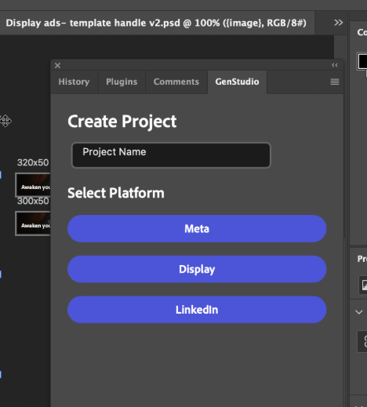
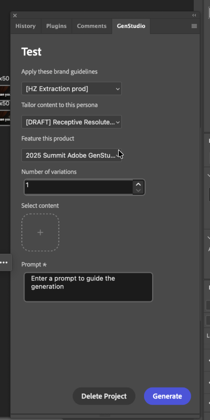
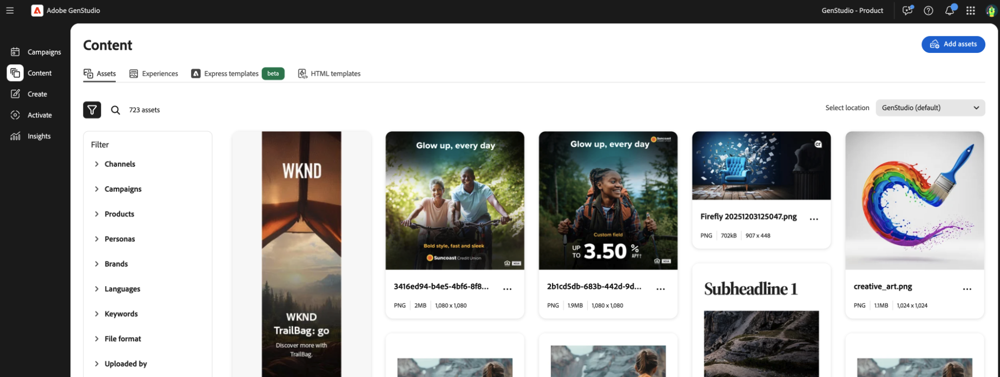

# 适用于GenStudio for Performance Marketing的Photoshop插件

GenStudio for Performance Marketing Photoshop插件会向Adobe Photoshop添加一个面板，以便您生成品牌内内容。

本页介绍如何安装和配置插件及其使用方法。

此插件的功能包括：

* 使用Adobe ID登录GenStudio for Performance Marketing实例
* 将GenStudio for Performance Marketing内容生成字段映射到Photoshop文档中的文本图层
* 指定用于生成内容的品牌、产品、角色和文本提示
* （可选）添加图像以替换模板图像
* 预览生成的品牌内内容变量
* 将生成的内容应用于当前文档中的映射图层
* 创建品牌内内容翻译
* 将生成的[!DNL Experiences]导出到GenStudio for Performance Marketing

>[!VIDEO](https://video.tv.adobe.com/v/3478808?learn=on)

## 安装插件

按照以下说明安装插件。

### 先决条件

* Creative Cloud桌面应用程序
* Photoshop，最低版本25.6.0

### 安装步骤

1. 从Adobe Exchange中的Creative Cloud Marketplace下载并更新该插件。
1. 在Adobe Exchange中搜索Photoshop的&#x200B;**GenStudio插件**。
1. 按照提示安装插件。

### 卸载插件

1. 启动Creative Cloud桌面应用程序。
1. 单击&#x200B;**[!UICONTROL 插件]**&#x200B;选项。
1. 单击适用于Creative Cloud的GenStudio卡片上的省略号&#x200B;**[!UICONTROL (...)]**&#x200B;以查看选项。
1. 选择&#x200B;**卸载**。

## 创建模板

要生成内容，您需要从GenStudio for Performance Marketing文档创建Photoshop模板。

要创建GenStudio就绪模板，请执行以下操作：

1. 在Photoshop中打开文档。
1. 为生成的内容标识文本图层。
1. 使用字段名约定格式重命名层： `{<name_of_generated_field>}`。 例如，`{body}`、`{headline}`、`{cta}`。
1. 重命名模板类型[的渠道所需的所有](../../user-guide/templates/customize-template.md#recognized-field-names)字段的图层。

| 渠道 | 生成所需的字段 | 用于生成的可选字段 |
| --- | --- | --- |
| LinkedIn | `{on_image_text}`、`{image}` | `{headline}`，`{introductory_text}`，`{cta}`，`{website_url}` |
| Meta | `{on_image_text}`、`{image}` | `{body}`，`{headline}`，`{cta}`，`{website_url}`，`{display_link}` |
| 显示器 | `{body}`、`{image}` | `{headline}`、`{cta}`、`{website_url}` |

请注意，多个层可以共享相同的字段指定，但每个层只能指定一个字段。 例如，如果文档中有多个画板：

* 您可以在每个画板中指定一个`{headline}`图层。
* 您可以在单个画板中指定多个`{headline}`图层。
* 您不能指定单个层同时接收`{headline}`和`{cta}`字段名称。

### 模板大小要求

#### Meta模板

对于Instagram和脸书上的帖子：

* 宽度：1080像素（固定）
* 高度：1080像素或1350像素

对于Instagram和Facebook故事：

* 宽度：1080像素（固定）
* 高度：1920像素

插件会根据模板的高度确定所生成体验的颜色。

#### 显示模板

没有固定大小要求。 显示模板支持任何大小。

#### LinkedIn模板

* 宽度：1200像素（固定）
* 高度：1200像素、628像素、2292像素、1800像素或1500像素

该文档现在已准备好与插件一起使用。

## 生成新内容

1. 打开Photoshop。
1. 打开您已创建的适用于GenStudio的模板文档（请参阅上面的说明），或使用GenStudio for Performance Marketing入门模板： `branding-template-acrobat-handlebars.psd`。
1. 在&#x200B;**[!UICONTROL 插件]** > **[!UICONTROL GenStudio]**&#x200B;处打开插件面板。
1. 单击&#x200B;**[!UICONTROL 登录]**&#x200B;按钮。 如果系统提示您提供打开URL的权限，请根据需要选中&#x200B;**记住我的选择**，然后单击&#x200B;**[!UICONTROL 允许]**。
1. 使用Web浏览器以有权访问GenStudio for Performance Marketing的配置文件登录。
1. 选择适用于已打开模板的渠道(Meta、LinkedIn或Display)。
   {width="300" zoomable="yes"}
1. 为内容生成选择[!DNL Brand]、[!DNL Persona]和[!DNL Product]上下文。
   {width="300" zoomable="yes"}
1. 选择要生成的变体数量。
1. 使用&#x200B;**[!UICONTROL 选择内容]**&#x200B;下的按钮浏览和选择资源中的图像。 40个最近添加的资产显示在最前，您可以搜索其他资产。 所选图像会自动调整大小以适合您的模板。
1. 在&#x200B;**[!UICONTROL 文本提示]**&#x200B;框中为内容提供文本提示。
1. 单击&#x200B;**[!UICONTROL 生成]**&#x200B;按钮。 变体会显示在插件面板的卡片上。

新文档将添加到您的Photoshop工作区，生成的内容将应用于模板字段。 这些文档的名称带有编号的变体后缀。

## 翻译内容

用户在生成副本后可以将内容翻译为支持的语言。

1. 使用该插件生成广告副本后，单击&#x200B;**[!UICONTROL 翻译]**。
1. 为翻译选择一种或多种语言。
1. 单击&#x200B;**[!UICONTROL 翻译]**&#x200B;按钮。

新文档将添加到您的Photoshop工作区，生成的内容将应用于模板字段。 这些文档的名称带有编号的变体后缀。

## 将体验导出到GenStudio

用户可以在内容生成或翻译后选择导出。 导出的体验会在GenStudio for Performance Marketing的内容部分中填充。

{width="90%"}

## 故障排除

如果生成的变体中未替换文本或图像，请考虑这些最佳实践和提示。

### 映射字段

如果未替换文本或图像，则使用大括号`{}`正确映射确认字段（不是括号`()`）。

### 确认字体可用

文本字段的字体必须在计算机上可用，才能在生成期间替换。 确认文件中使用的所有字体在您的计算机上都可用，尤其是当文件是在其他人的计算机上创建时。

### 字段映射例外

{{$include /help/_includes/field-mapping-exceptions.md}}
