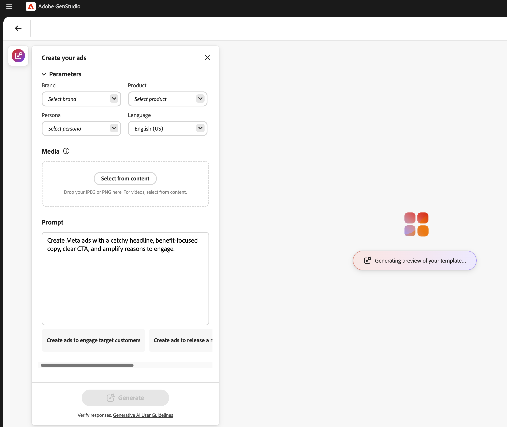
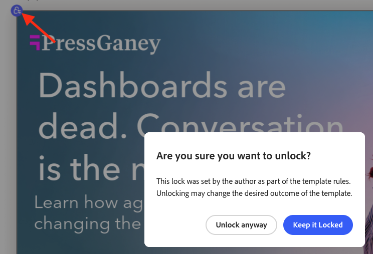

# 使用[!DNL Adobe Express]模板

[!DNL GenStudio for Performance Marketing]可以使用已在[!DNL Adobe Express]中创建和设计的模板。 从[!DNL Adobe Express]引入品牌资产，并使用这些强大的工具将它们集成到引人注目的营销活动和[!DNL Experiences]中。

本指南介绍[!DNL Adobe Express]模板的要求和功能。

## 关于[!DNL Adobe Express]中的模板

在[!DNL Adobe Express]中，可以使用应用程序中提供的现有启动程序模板[&#128279;](https://helpx.adobe.com/express/web/documents-and-presentations/text-flow-template.html?x-product=Helpx%2F1.0.0&x-product-location=Search%3AForums%3Alink%2F3.7.5)创建新文档，也可以使用包含有用的品牌限制的[自定义模板创建](https://helpx.adobe.com/express/web/brands-libraries-projects/create-manage-brands/edit-shared-template.html)新文档，例如：

- 无法更改的[锁定的元素](https://helpx.adobe.com/express/web/invite-collaborate/object-locking.html)
- 锁定限制可控制用户在需要时如何解锁元素

已在[!DNL Adobe Express]中的模板上设置的锁定设置也将在[!DNL GenStudio for Performance Marketing]中应用。 使用[说明 [!DNL Adobe Express] 创建具有品牌限制的自定义模板](https://helpx.adobe.com/express/web/brands-libraries-projects/create-manage-brands/template-control.html)。

要在Express模板中使用自定义字体，管理员必须首先在Admin Console中接受“自定义字体”资格鉴定选件，该选件包含在Express许可证权利中。

## 查找快速模板

用户将在“创建以选择快速模板”中看到新选项卡。 在以下情况下，可以在GenStudio for Performance Marketing中访问快速模板：

- 由用户创建
- 已共享给用户
- 已共享到用户的组织，在两个应用程序中使用相同的IMS组织

选择模板类型后，在“创建”工作流中查找任何可用的“快速处理”模板。 快速模板仅适用于以下类型：

- [!DNL Meta]
- [!DNL Display]
- [!DNL LinkedIn]
- [!DNL TikTok]

在&#x200B;**[!UICONTROL 选择模板]**&#x200B;下的顶部栏中，查找&#x200B;**快速模板**。

{width=70%}

当您选择[!DNL Express]模板并单击&#x200B;**[!UICONTROL 使用]**&#x200B;时，预草稿参数和提示将显示在左侧的弹出面板中。 单击&#x200B;**[!UICONTROL 生成]**&#x200B;按钮以使用所选模板创建新内容。

{width=90%}

>[!IMPORTANT]
>
>在内容生成期间，Express模板层将自动标记为[!DNL GenStudio for Performance Marketing]的字段角色。 模板上的元素也可以[手动标记](#manual-tagging-of-templates)。

## 关于变体和[!DNL Experiences]及[!DNL Adobe Express]模板

[!DNL Express]模板提供了许多在[管理其他变体](https://experienceleague.adobe.com/en/docs/genstudio-for-performance-marketing/user-guide/create/manage-variants#manually-edit-text)时您将熟悉的功能。 但是，有一些功能强大的添加项可简化来自[!DNL Express]的内容的任何工作流。 本节介绍[!DNL Adobe Express]实现特有的功能。

### 自动生成多个大小

在 [!DNL Express][&#128279;](https://helpx.adobe.com/express/web/arrange-layers-and-pages/add-pages.html)中为一个资产创建了多个页面后，这些页面将转移到从该资产创建的任何模板中。 Express页面将在[!DNL GenStudio for Performance Marketing]中生成不同大小的创意内容。

当[!DNL Express]中的某个资源存在多个大小的内容时，可以在单个生成过程中为所有这些大小生成变体。

### 重新定位元素并调整其大小

只需在“画布”窗格中单击并拖动模板上的元素，即可调整其大小或移动这些元素以适合模板。

通过从角点单击并拖动元素来调整大小。

### 画布窗格标题功能

使用“画布”窗格标题中的按钮可以：

1. 重新命名草稿
1. 更改查看的缩放级别
1. 撤消和重做更改

### 分配体验组反馈

体验标头中的

将反馈分配给生成的变体的每个组。 这些反馈标签可帮助AI了解在后代中应考虑哪些变体。

单击“……” 要打开以下项的下拉菜单，请执行以下操作：

- 输出良好
- 输出差
- 删除 — 删除变体组。

### 删除变体

可以使用垃圾桶图标删除一组体验中生成的单个变体大小。

{width=300}

### 空格键到平移

保留&#x200B;**[!UICONTROL 空间]**&#x200B;以启用点击拖动功能来“拉取”画布视图窗格。

还可以使用双指滚动来移动视图窗格。

### 手动编辑文本

您可以编辑生成的变体中的文本字段。 通过尝试不同的短语和措辞并应用格式，优化面向受众的文本。 例如，您可以粗体和右对齐变体的文本，以适应图像的布局。

{width=60%}

可用的文本格式包括：

- 粗体、斜体和下划线
- 文本颜色（黑色、白色或品牌颜色）
- 左、中和右对齐
- 项目符号和有序列表
- 文本大小
- 上标或下标

**若要在生成的变量中手动编辑文本**：

1. 生成变体集后，双击变体中的可编辑文本。
1. 输入新文本。
1. 要设置文本格式，请单击或在文本框元素中键入。 格式设置选项将显示在弹出栏中。 按住Shift键将隐藏要查看文本的栏。
1. 单击文本字段以外的以保存任何更改。

### 查看图层

您可以快速选择变体的单个图层并进行更改，如重新生成截面或裁切图像。 选择单个图层时，图层中的可编辑字段或图像会突出显示。

**要查看变体**&#x200B;的层：

1. 生成变体集后，单击变体中的可编辑字段或图像。 图层将显示在右上角的一行图块中。
   变体中的{width=50%}
1. 单击图层拼贴以将其选中。 为变体加亮所选的层。
1. 继续对选定图层进行任何必要的编辑。

### 重写部分

[!DNL GenStudio for Performance Marketing]具有用于重新生成生成的变体的部分的内置功能。 您可以重新短语、缩短或加长文本，或者添加新的提示来生成新内容。

例如，您可以重新生成一个Meta广告变体的标题部分，以查看它在特定后台资源中的外观。 您可以&#x200B;**[!UICONTROL 重新短语]**、**[!UICONTROL 缩短]**、或者&#x200B;**[!UICONTROL 加长]**&#x200B;分区的文本内容，或者&#x200B;**[!UICONTROL 使用指导提示重新生成]**&#x200B;文本。

{width=50%}

**要重写各个变体节**：

1. 生成变体集后，单击变体中的任何可编辑文本。 将显示棒图标。
1. 单击棒图标以打开“重写”窗格。
1. 若要更改现有文本，请选择&#x200B;**[!UICONTROL 重新短语]**、**[!UICONTROL 缩短]**&#x200B;或&#x200B;**[!UICONTROL 加长]**。
1. 要生成新的措辞选项，请选择&#x200B;**[!UICONTROL 重新生成]**&#x200B;并输入新的提示。
   1. 单击&#x200B;**[!UICONTROL 生成]**。
1. 结果将作为选项显示在窗格中。 选择所需的选项，然后单击&#x200B;**[!UICONTROL 替换]**。 使用修订后的文本更新变体。

{width=50%}

### 裁切资源

您可以使用裁切工具手动裁切和重新定位单个生成变量中的图像资源。

**若要裁切和重新定位变量中的图像**：

1. 生成一组变体后，双击资产以激活定界框。
1. 通过从任何边缘或角拖动来调整图像边界框，或将整个图像拖动到所需位置。

### 交换资产

您可以直接从Canvas UI在生成的变体中添加或交换图像、批准的徽标或视频资产。

**在变体**&#x200B;中添加或交换资源：

1. 生成一组变体后，单击资产（如果图像当前不存在，则单击图像资产区域）。 将显示交换图标。
1. 单击交换图标以打开选择资源页面。
1. 使用GenStudio Assets内容视图中的筛选器和搜索功能进一步缩小搜索结果。
1. 您还可以通过从&#x200B;**[!UICONTROL 位置]**&#x200B;菜单中选择连接的[!DNL Adobe Experience Manager] (AEM) Assets Content Hub存储库中的可用图像来使用该存储库。
1. 单击选择图像，然后单击&#x200B;**[!UICONTROL 使用]**。 图像已添加或交换到适用的变量中。

### 手动标记模板

在“创建”工作流的[模板生成](#find-express-templates)过程中，模板中的元素会被自动标记。 但这些元素也可以手动标记。

**手动标记模板元素**：

1. 选择模板上的元素。
1. 使用下拉菜单选择该元素的标记。
   {width=80%}

标记选项因元素类型而异。

### 模板锁定限制

模板可以包含从[!DNL Express]结转的[锁定元素](https://helpx.adobe.com/express/web/invite-collaborate/object-locking.html)，并控制某些功能的更改方式。 这些设置由模板遵循，也可以在模板上更改：

1. 在模板上选择一个锁定的元素。
1. 单击选定元素左上角的锁定图标。
1. 选择正确的选项以解锁该元素。
   {width=60%}

### 视频程序集

包含视频的模板可以利用视频汇编功能。

**要使用视频程序集**：

1. 选择体验并单击&#x200B;**[!UICONTROL 编辑]**&#x200B;按钮进入焦点模式并使用视频程序集功能。 将只显示单个变体，并且场景线将沿底部显示。
   {width=70%}
1. 调整您的视频体验。 视频组件选项包括：
   - 播放视频
   - 静音和取消静音
   - 使用“+”按钮添加新视频内容
   - 视频持续时间设置
   - 使用拖放更改视频内容的顺序
1. 编辑完视频后，使用顶部的&#x200B;**[!UICONTROL 退出]**&#x200B;按钮保存更改并返回到无限画布。

### 使用生成性展开修改图像

图像图层可以用AI扩展其边界，以适合体验中的任何所需尺寸。

**要使用生成展开**&#x200B;展开图像：

1. 选择一个已解锁的图像图层，然后单击图像框架底部的&#x200B;**[!UICONTROL 展开]**&#x200B;按钮。
   {width=70%}
1. 将框架拉到图像将要展开的所需尺寸。 将出现“Expand options（展开选项）”窗口。 在“展开”选项中，您可以通过以下方式促进展开：
   - 输入提示
   - 选择适合框架
   - 重置维度
     {width=50%}
1. 单击&#x200B;**[!UICONTROL 展开]**&#x200B;以创建层代。 从中进行选择的变体将显示在框架底部。
1. 选择最佳变体并单击&#x200B;**[!UICONTROL 保留]**。
   {width=50%}

{width=60%}

### 品牌验证

使用&#x200B;_内容检查_&#x200B;面板可以保持一致的品牌标识、ADA辅助功能标准、平台指南和变体一致。

请参阅[品牌验证](/help/user-guide/guidelines/brand-validation.md)。

## 审阅并批准

编辑和调整变体后，通过[审阅和批准工作流](https://experienceleague.adobe.com/en/docs/genstudio-for-performance-marketing/user-guide/approve/overview)批准并发布您的内容。

